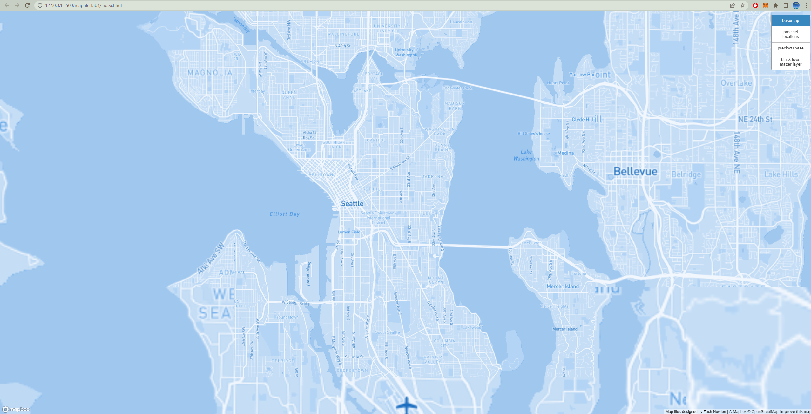
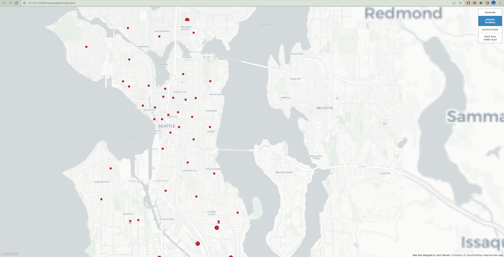
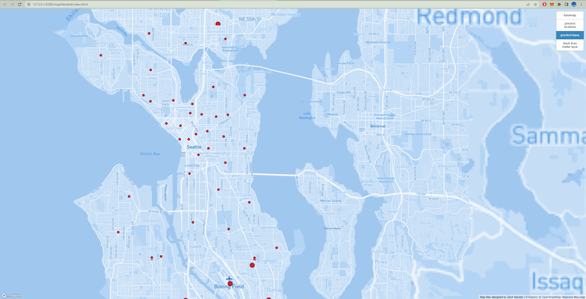
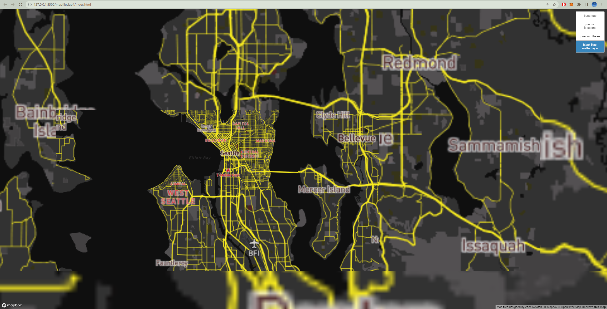

# Map Tiles Lab 4
## URL to access the web map
https://znewton-1831937.github.io/maptileslab4/

## The examined geographic area
The area that was examined in this lab was the Seattle area and the areas around Seattle. This lab looked at police precinct locations around Seattle as well as different layers based on themes such as monochrome and the Black Lives Matters movement, a movement that has great history in Seattle and its beliefs of contesting police brutality.

## Screenshots of four layers with zoom levels and descriptions
For all tile sets, the available zoom levls are 1 through 14

The first tile set is of a base layer that was provided by mapbox. It is a basic blue monochrome that allows the user to move around and understand the geography around seattle.

The second tile set is a of a basic base layer with point data depicting the locations of police precincts distributed throughout Seattle. The data was provided by the open data Seattle project at data.seattle.gov

The third tile set is a culmination of both the first and the second and combines the point data with the original base layer to create a new map that has a great base with informational points.

The final tile set is a base layer that was designed with a them in mind. For this basemap, the theme was the Black Lives Matter movement that has gained popularity in the last 10 years. The layer attempts to carry the theme by utilizing the color scheme that is often used by the movement.